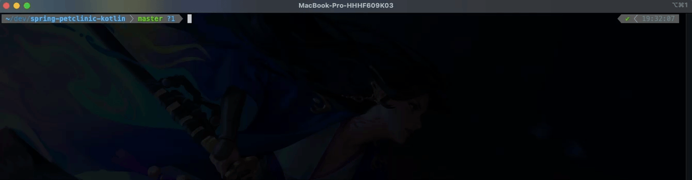

# iProcrastinay

### *Say nay to post compile-time procrastination!*

Get system notifications when your build is finished and save little by little time every day.

- on **macOS** or **Linux**
- **Maven** & **Gradle** supported
- in-console and via IDE builds
- works with [Maven Daemon](https://github.com/apache/maven-mvnd) out of the box



### How it works

During the installation your Java executable is wrapped up in a shell script which takes
care about everything. No magic, no plugins, just a plain shell scripting.

### Prerequisites
- MacOS: [terminal-notifier](https://github.com/julienXX/terminal-notifier) installed (`brew install terminal-notifier`)
- Linux: [notify-send](https://manpages.debian.org/bullseye/libnotify-bin/notify-send.1.en.html) installed (`apt-get install libnotify-bin`)

### Installation

1. Clone this repository using git or just download the installation script:
```
curl -s https://raw.githubusercontent.com/raxigan/i-procrastinay/main/install.sh --output install.sh
```
2. Assign appropriate permissions to the script to be able to execute it:

```
chmod u+x install.sh
```

3. Then run it using one of the following modes:

- simple mode (sufficient in most cases): `./install.sh` (no parameters)
  - tweaks your Java set in JAVA_HOME environment variable
- SDKMAN mode: `./install.sh --sdkman`
  - tweaks all your Java instances installed via [SDKMAN](https://sdkman.io/)
- custom paths mode: `./install.sh /path/to/java1 /path/to/java2 ...`
  - tweaks all you Java instances under provided absolute paths (pointing to `bin` directory parent)